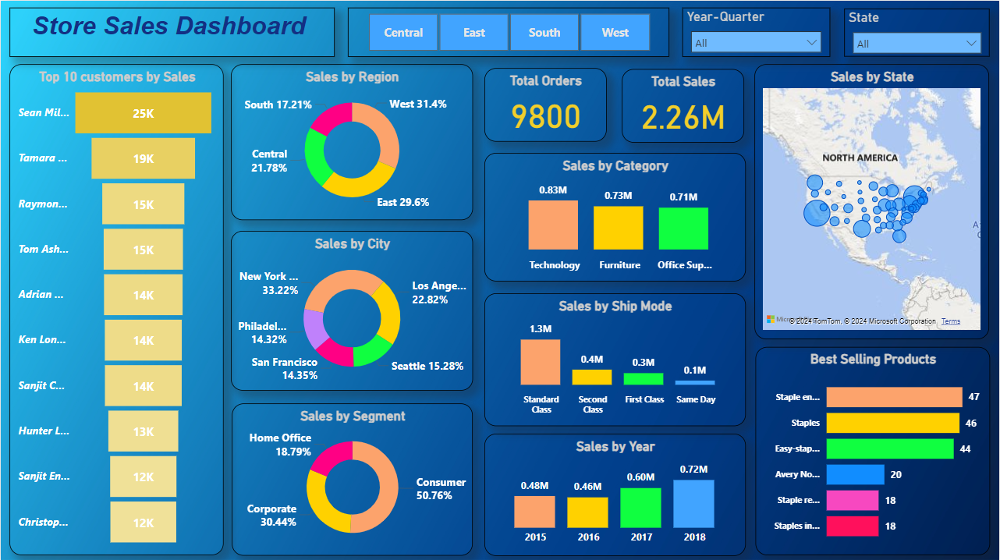

Sales Data Analysis for Commercial Store - Task 1
=================================================

🏢 **Brainwave Matrix Internship - Task 1**
-------------------------------------------

Welcome to the **Task 1** folder of the **Brainwave Matrix Internship** repository. This task focuses on analyzing sales data from a commercial store (retail or online), with the goal of uncovering insights that can help improve the store's performance and guide decision-making.

* * *

📝 **Project Overview**
-----------------------

In this project, I have conducted a detailed **Sales Data Analysis** for a commercial store. The analysis aims to provide actionable insights into various aspects of the sales performance, such as:

*   Sales trends over time.
*   Segment and category-wise performance.
*   Geographical analysis of sales.
*   Shipping mode preferences and their impact on sales.

The analysis was conducted using **Python** and various data manipulation libraries, including **pandas** and **matplotlib**, to clean, visualize, and interpret the data. The findings aim to provide insights into sales patterns, which can be used to optimize future sales strategies.

* * *

🔧 **Technologies Used**
------------------------

*   **Python** (for data manipulation, analysis, and visualization)
*   **pandas** (for data cleaning and transformation)
*   **matplotlib / seaborn** (for data visualization)
*   **Jupyter Notebook** (for the development and execution of the analysis)
*   **Power Bi** (for the development of Dashboard)   

📊 **Power BI Dashboard Preview**
---------------------------------

  <strong>Power BI Dashboard Preview</strong>
  
Below is a preview of the Power BI Dashboard created for sales analysis:

  

    
* * *

🏁 **How to Run the Code**
--------------------------

1.  **Clone the repository:**
    
    git clone https://github.com/your-username/Brainwave\_matrix\_intern.git
    
2.  **Navigate to the Task 1 folder:**
    
    cd Brainwave\_matrix\_intern/Task1
    
3.  **Install the required dependencies:**
    
    pip install pandas matplotlib seaborn
    
4.  **Run the Jupyter notebook:**
    
    jupyter notebook analysis\_notebook.ipynb
    

* * *

📊 **Insights & Key Findings**
------------------------------

Here are some key insights from the analysis:

*   **Home Office Segment** showed the highest average sales across all segments.
*   **New York, Los Angeles, and San Francisco** had the highest number of orders.
*   **New York and Washington** states reported the highest average sales.
*   **Technology** products led the sales, particularly **phones** and **chairs** in sub-categories.
*   **Standard shipping** mode was the most popular, though **same-day shipping** saw a slight increase in sales.

For more detailed insights and visualizations, refer to the **Jupyter Notebook** and the **summary report**.

* * *

📄 **Expected Deliverables**
----------------------------

*   **Well-commented Jupyter Notebook** - explaining the step-by-step analysis and methodology.
*   **Summary Report (PDF)** - Key findings and recommendations in a structured format.
*   **Power BI Dashboard** - Visual representation of the analysis with interactive charts.
*   **Key Metrics** - Various performance metrics calculated and analyzed during the project.

* * *

✍️ **Author**
-------------

This project was completed as part of my internship at **Brainwave Matrix Solutions**. Feel free to explore and provide feedback on my work!

* * *
🔮 Sentiment Analysis Web App and EDA  -Task 2 😃
=============================

Welcome to the Sentiment Analysis EDA and  Web App built with Streamlit! This app performs sentiment analysis on input text using Natural Language Processing (NLP) techniques and SpaCy's pre-trained models. 🚀

Project Overview 📊
-------------------

This project is designed to uncover sentiment insights on the twitter dataset and analyze the sentiment of text input by users. It uses machine learning models (Random Forest) to classify the text as either positive, negative, or neutral. The backend uses **SpaCy** and **scikit-learn** for processing and model prediction.

Technologies Used 🛠️
---------------------

*   **Streamlit** - For creating the interactive web application
*   **SpaCy** - For natural language processing and sentiment analysis
*   **scikit-learn** - For machine learning algorithms
*   **WordCloud** - For generating word clouds based on sentiment data
*   **seaborn & matplotlib** - For data visualization
*   **Jupyter Notebook** - For Exploratory data analysis
*   **TF-IDF** -For Vectorization of tokens.
  

Installation 💻
---------------

To run this app locally, follow the steps below:

1.  Clone the repository: `git clone [https://github.com/your-username/nlp-task-sentiment-analysis](https://github.com/your-username/nlp-task-sentiment-analysis)`
2.  Navigate to the project directory: `cd nlp-task-sentiment-analysis`
3.  Create a virtual environment: `python3 -m venv venv`
4.  Activate the virtual environment:
    *   For Windows: `venv\\Scripts\\activate`
    *   For macOS/Linux: `source venv/bin/activate`
5.  Install the required dependencies: `pip install -r requirements.txt`
6.  Run the Streamlit app: `streamlit run website.py`

Usage 📝
--------

Once the app is running, you can input text and the app will classify its sentiment as positive, negative, or neutral. 🌟

live web app Link 📄
---------------

* https://nlp-task-sentiment-analysis-akash.streamlit.app/

Contributing 🤝
---------------

If you would like to contribute to this project, feel free to fork it, make improvements, and create a pull request. 🚀

License 📜
----------

This project is licensed under the MIT License - see the [LICENSE](LICENSE) file for details.

Made with ❤️ by Akash Anandani

* * *

📄 **License**
--------------

This project is open-source and available under the MIT License.
